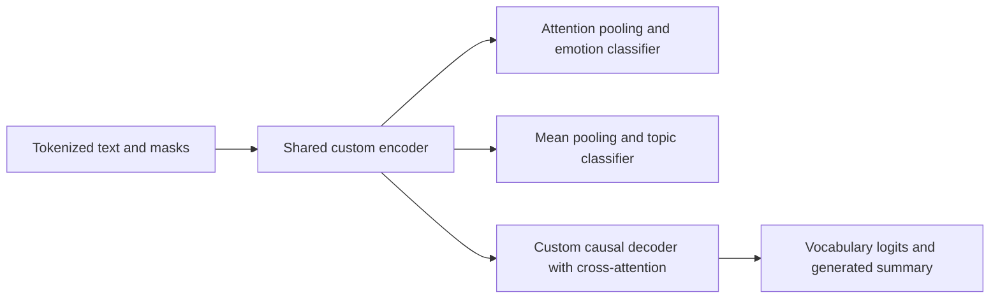

# LexiMind architecture

LexiMind has two independent parts: a deployed book-discovery website and a
from-scratch transformer research implementation. The website consumes attributed
catalogue metadata; it does not invoke the research model.

## Book discovery and catalogue

`web/` contains the Next.js application. `web/data/books.json` is its fixed
catalogue, verified against `web/data/catalog-manifest.json`. Search and
recommendations in `web/lib/recommendations.ts` use weighted TF-IDF, metadata
overlap, and modest author/genre diversity. Browser-local favourites influence
recommendations; reading lists and hidden books are also stored locally.

`scripts/build_book_catalog.py` and `src/catalog/` build that snapshot from cached
Open Library records. Work IDs, author agreement, source hashes and explicit
review decisions control admission. Descriptions stay attached to their identified
works. Publication stages catalogue/manifest/receipt files under a writer lock;
loaders reject mismatched generations. See the
[catalogue contract](../data/catalog/README.md) and [product scope](product.md).

## The custom transformer

The custom implementation is intentional. `src/models/` defines the computational
layers; `src/models/factory.py` assembles them and transfers pretrained FLAN-T5
weights. An upstream T5 model is used as the weight source during initialization,
not as a replacement for LexiMind's forward pass. Tokenization is wrapped in
`src/data/tokenization.py`.

The FLAN-T5-base configuration has 12 encoder layers, 12 decoder layers,
768-dimensional hidden states, 12 attention heads, a 2,048-dimensional feed-forward
intermediate, and a padded vocabulary of 32,128. Other dimensions remain
configurable. Head sizes follow explicit label metadata rather than a fixed book
taxonomy.

| Component | Implementation and role |
| --- | --- |
| Attention | `attention.py`: scaled-dot-product and multi-head attention, masks, T5 bucketed relative-position bias, optional SDPA execution |
| Encoder | `encoder.py`: bidirectional layers, residual paths, normalization and configurable activation checkpointing |
| Decoder | `decoder.py`: causal self-attention, encoder cross-attention, autoregressive decoding, and incremental key/value caches |
| Feed-forward and normalization | `feedforward.py` and `t5_layer_norm.py`: configurable feed-forward blocks including gated GELU and T5-style normalization |
| Positions | `positional_encoding.py`: absolute-position alternatives; the FLAN-T5 path uses relative-position bias |
| Task heads | `heads.py`: masked pooling, sequence/token classifiers, vocabulary projection, and representation projection |
| Task dispatch | `multitask.py`: a shared encoder with explicitly registered task heads and a summarization decoder |
| Construction | `factory.py`: configuration validation, module assembly and layer-by-layer pretrained-weight transfer |

The FLAN path preserves T5-specific attention scaling and positional treatment.
Emotion classification uses learned attention pooling and an MLP; topic
classification uses masked mean pooling and a linear output. These are task
interfaces, not evidence that either pooling choice is universally superior.
Classification uses encoder states without running the decoder. Summarization
uses the decoder's logits and cached generation path.

The model supports padding/causal masks, optional attention inspection, configurable
dropout, and multiple feed-forward/position choices. Numerical tests exercise
those behaviors. Successful component tests do not by themselves establish exact
checkpoint equivalence or the quality of a trained model.

## Training and inference

`src/training/trainer.py` coordinates task-specific losses, task sampling, gradient
accumulation, mixed precision where supported, learning-rate scheduling, validation,
and checkpoint callbacks. `pcgrad.py` implements optional gradient-conflict
projection. Metrics and calibration utilities remain separate from model layers.

`src/inference/` loads explicit checkpoints, tokenizers and label metadata. Its
combined prediction path can share one encoder pass across the supported heads
and summary decoder; individual task methods remain available. Scripts expose
training, evaluation, inference and profiling for later authorized research work.

The book site has no dependency on that runtime. Research outputs must pass their
own source, domain and evaluation review before becoming catalogue features.
Training and experiments are currently paused; see
[current research preparation](research/README.md) for the proposed studies and
remaining data, interface, budget and evaluation decisions.

## Dataset loading

The core trainer and profiler share task-specific preparation. They index JSONL
with 16 bytes of offsets/line numbers per row and decode requested batches on
demand, avoiding retained corpus-text copies in spawned workers. Prefix limits
bound sample indexing/decoding; classification without `labels.json` still scans
its complete training split to establish the vocabulary. The reconstructed
candidates supply label maps, avoiding that extra scan. Disabled tasks and unused
test splits are not loaded. Padding remains dynamic within each minibatch.

Legacy JSON arrays still load eagerly, and emotion validation remains materialized
for the existing full-split calibration helper. Lazy reads trade repeated decoding
for lower retained memory; no GPU throughput improvement is claimed. File-stat
checks detect ordinary source edits, while research manifests provide content hashes.
The default data paths are unset: explicit dataset directories are required before
any tokenizer, model or device initialization.

Classification vocabularies must describe the full training task, including classes
absent from a capped prefix. Explicit `labels.json` order is authoritative; otherwise
the complete training split supplies the vocabulary without retaining full text.
Validation/test labels never choose the training label space. Unknown labels fail
instead of being silently discarded. Weights-only continuation requires
`resume_labels` matching the exact active label order; unchanged head dimensions
alone do not establish semantic compatibility.
