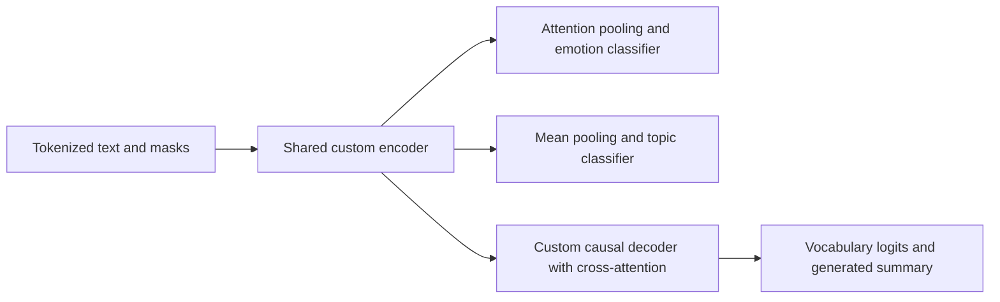

# LexiMind architecture

LexiMind has two independent parts: a deployed book-discovery website and a
from-scratch transformer research implementation. The website consumes attributed
catalogue metadata; it does not invoke the research model.

## Book discovery and catalogue

`web/` contains the Next.js application. `web/data/books.json` is its fixed
catalogue, verified against `web/data/catalog-manifest.json`. Search and
recommendations in `web/lib/recommendations.ts` use weighted TF-IDF, metadata
overlap, and modest author/genre diversity. Browser-local favourites influence
recommendations; reading lists and hidden books are also stored locally.

`scripts/build_book_catalog.py` and `src/catalog/` build that snapshot from cached
Open Library records. Work IDs, author agreement, source hashes and explicit
review decisions control admission. Descriptions stay attached to their identified
works. Publication stages catalogue/manifest/receipt files under a writer lock;
loaders reject mismatched generations. See the
[catalogue contract](../data/catalog/README.md) and [product scope](product.md).

## The custom transformer

The custom implementation is intentional. `src/models/` defines the computational
layers; `src/models/factory.py` assembles them and transfers pretrained FLAN-T5
weights. An upstream T5 model is used as the weight source during initialization,
not as a replacement for LexiMind's forward pass. Tokenization is wrapped in
`src/data/tokenization.py`.

```mermaid
flowchart LR
  Text[Tokenized text and masks] --> Encoder[Shared custom encoder]
  Encoder --> Emotion[Attention pooling and emotion classifier]
  Encoder --> Topic[Mean pooling and topic classifier]
  Encoder --> Decoder[Custom causal decoder with cross-attention]
  Decoder --> Summary[Vocabulary logits and generated summary]
```

The FLAN-T5-base configuration has 12 encoder layers, 12 decoder layers,
768-dimensional hidden states, 12 attention heads, a 2,048-dimensional feed-forward
intermediate, and a padded vocabulary of 32,128. Other dimensions remain
configurable. Head sizes follow explicit label metadata rather than a fixed book
taxonomy.

| Component | Implementation and role |
| --- | --- |
| Attention | `attention.py`: scaled-dot-product and multi-head attention, masks, T5 bucketed relative-position bias, optional SDPA execution |
| Encoder | `encoder.py`: bidirectional layers, residual paths, normalization and configurable activation checkpointing |
| Decoder | `decoder.py`: causal self-attention, encoder cross-attention, autoregressive decoding, and incremental key/value caches |
| Feed-forward and normalization | `feedforward.py` and `t5_layer_norm.py`: configurable feed-forward blocks including gated GELU and T5-style normalization |
| Positions | `positional_encoding.py`: absolute-position alternatives; the FLAN-T5 path uses relative-position bias |
| Task heads | `heads.py`: masked pooling, sequence/token classifiers, vocabulary projection, and representation projection |
| Task dispatch | `multitask.py`: a shared encoder with explicitly registered task heads and a summarization decoder |
| Construction | `factory.py`: configuration validation, module assembly and layer-by-layer pretrained-weight transfer |

The FLAN path preserves T5-specific attention scaling and positional treatment.
New FLAN runs can select `gated-gelu-tanh` for upstream `gelu_new` parity. Existing
`gated-gelu` configurations retain their exact-GELU behavior and checkpoint keys.
Emotion classification uses learned attention pooling and an MLP; topic
classification uses masked mean pooling and a linear output. These are task
interfaces, not evidence that either pooling choice is universally superior.
Classification uses encoder states without running the decoder. Summarization
uses the decoder's logits and cached generation path.

The model supports padding/causal masks, optional attention inspection, configurable
dropout, and multiple feed-forward/position choices. Numerical tests exercise
those behaviors. Successful component tests do not by themselves establish exact
checkpoint equivalence or the quality of a trained model.

## Training and inference

`src/training/trainer.py` coordinates task-specific losses, task sampling, gradient
accumulation, mixed precision where supported, learning-rate scheduling, validation,
and checkpoint callbacks. `pcgrad.py` implements optional gradient-conflict
projection on the encoder; decoder/head gradients are summed even when generative
objectives share them. Metrics and calibration utilities remain separate from model layers.
The trainer and profiler share model/adapter/freeze/optimizer construction in
`src/training/utils.py`; the profiler calls the same epoch loop. Metrics accumulate fixed-size summaries;
threshold calibration vectorizes classes, and PCGrad reuses reference norms.
`generation_metrics=false` skips teacher-forced text decoding/ROUGE during
loss-only runs; tracking can use a separate local database for each experiment.

Classification heads explicitly select single-label CE or multi-label BCE. Book
fields opt in through `data.topic_problem_type=multi_label`; legacy topic CE and
dense emotion BCE remain supported. A boolean `label_mask` supervises only known
cells. Entirely unknown training windows leave optimizer/scheduler state unchanged;
validation tasks with no observed labels are rejected before model selection.
Epoch diagnostics aggregate observed counts and report coverage, not complete-label
accuracy. Gradient accumulation retains the existing average of microbatch losses;
it is not an observed-cell average across the entire accumulation window.

`src/inference/` loads explicit checkpoints, tokenizers and label metadata. Its
combined prediction path can share one encoder pass across the supported heads
and summary decoder; individual task methods remain available. Scripts expose
training, evaluation, inference and profiling for later authorized research work.
Book checkpoints use `predict_book_fields` with explicit thresholds and independent
sigmoid scores; legacy topic/batch APIs reject that mode. The opt-in
`training=book_lora` recipe supports the partial-label topic path on MPS and CUDA.
Thresholds still need calibration; synthetic engineering checks do not establish
book model quality. [Current commands and measured boundaries](research/README.md#current-runtime-readiness)
describe the M5 evidence and pending RTX 4070 execution.

`src/models/adapters.py` attaches LoRA only to named native attention projections,
freezes base weights, and keeps private decoder/head state separate. Task arithmetic
and TIES merge effective matrices (`B @ A`), then materialize into an independent
copy of the same full base. Matching base/layout hashes and private initialization
are required; matching tensor shapes alone do not establish label compatibility.

The book recipe attaches rank-four encoder Q/V adapters and a private topic head,
then creates AdamW from trainable parameters only. Native FLAN weights are pinned
and read offline; MPS uses float32 without CPU fallback, while supported CUDA uses
native BF16 autocast with float32 weights. Unscaled FP16 training is rejected.
Classification retains the frozen decoder for checkpoint compatibility.

LoRA checkpoints save ordinary merged weights plus a separate small adapter
artifact. Paired model/label/tokenizer contracts preserve activation, ordered
columns, problem type, mapping and input formatting. Tokenizer binding includes
effective classification length, padding, special IDs, vocabulary and backend
normalization/pretokenization. Inference automatically restores those contracts.
Weights-only adapter continuation validates the original base/head initialization,
current and paired labels, and encoding contract before copying factors/head state;
optimizer, scheduler and RNG state are reset. Each file is written atomically,
but the artifact set is not one transaction. Legacy checkpoints remain readable.

`src/training/rl.py` contains group-relative objectives, DPO and information-gain/EMA
primitives. `policy.py` supplies full-support sampling, response-only scoring and
verifiers through `Trainer.policy_objectives`. It disables dropout consistently
and ambient autocast, checks the precision contract, and restores caller modes;
this also disables checkpointing tied to training mode,
so GPU feasibility needs measurement. Policy surrogate loss cannot select the best
checkpoint. Native policy tasks currently require accumulation of one: the existing
microbatch-mean accumulation would change token-weighted policy reductions.
The ordinary CLI does not start an RL run; reward data and a separately
specified experiment are still required.

The book site has no dependency on that runtime. Research outputs must pass their
own source, domain and evaluation review before becoming catalogue features.
Bounded local MacBook pilots are authorized; see
[current research preparation](research/README.md) for observations, proposed studies and
remaining data, interface, budget and evaluation decisions.

## Dataset loading

The core trainer and profiler share task-specific preparation. They index JSONL
with 16 bytes of offsets/line numbers per row and decode requested batches on
demand, avoiding retained corpus-text copies in spawned workers. Prefix limits
bound sample indexing/decoding; classification without `labels.json` still scans
its complete training split to establish the vocabulary. The reconstructed
candidates supply label maps, avoiding that extra scan. Disabled tasks and unused
test splits are not loaded. Padding remains dynamic within each minibatch.

Legacy JSON arrays still load eagerly. Emotion calibration uses indexed selection
views with the previous split membership/order, without retaining decoded text.
Lazy reads trade repeated decoding
for lower retained memory; no GPU throughput improvement is claimed. File-stat
checks detect ordinary source edits, while research manifests provide content hashes.
The default data paths are unset: explicit dataset directories are required before
tokenizer/model construction. The opt-in recipe may verify cached weights and
configure the selected device before opening those datasets.

Classification vocabularies must describe the full training task, including classes
absent from a capped prefix. Explicit `labels.json` order is authoritative; otherwise
the complete training split supplies the vocabulary without retaining full text.
Validation/test labels never choose the training label space. Unknown labels fail
instead of being silently discarded. Weights-only continuation requires
`resume_labels` matching the exact active label order; unchanged head dimensions
alone do not establish semantic compatibility.

Book split JSONL uses `title`, `description`, `positive` and `negative`; the last
two are lists of `facet:label` IDs. Only title/description are tokenized. Its
`labels.json` is an object with `schema_version: 1`, `problem_type: "multi_label"`,
`input_format: "book_title_description_v1"`, the ordered `labels`, and the reviewed
`mapping_sha256`. No candidate directory is selected or exported automatically.
Book label metadata records the same loss/input/mapping contract. It is written
before any checkpoint, also beside the weights as `labels.json`; incompatible
existing metadata is preserved and rejected. Resume/inference validate that contract.

Cached decoding uses preallocated output buffers and incremental n-gram state.
Both full and cached attention apply native/legacy LoRA projections. SDPA preserves
learned relative biases without clipping; tests compare logits and gradients.
